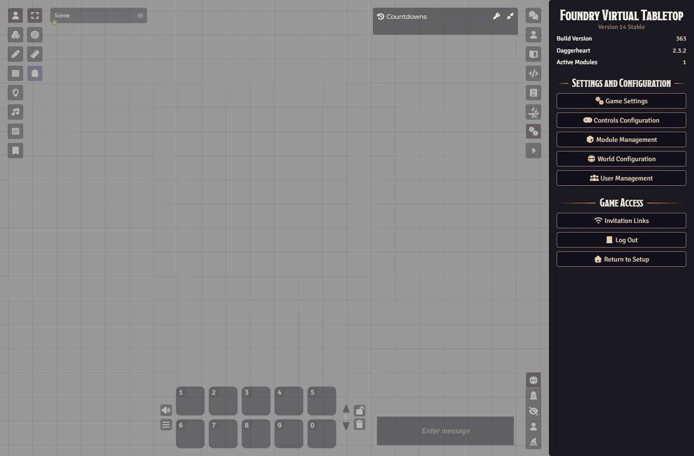
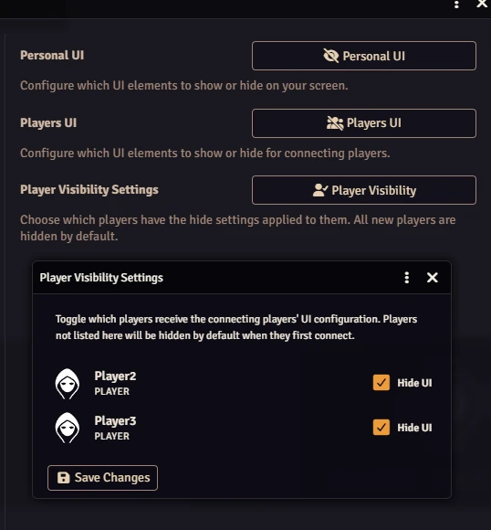
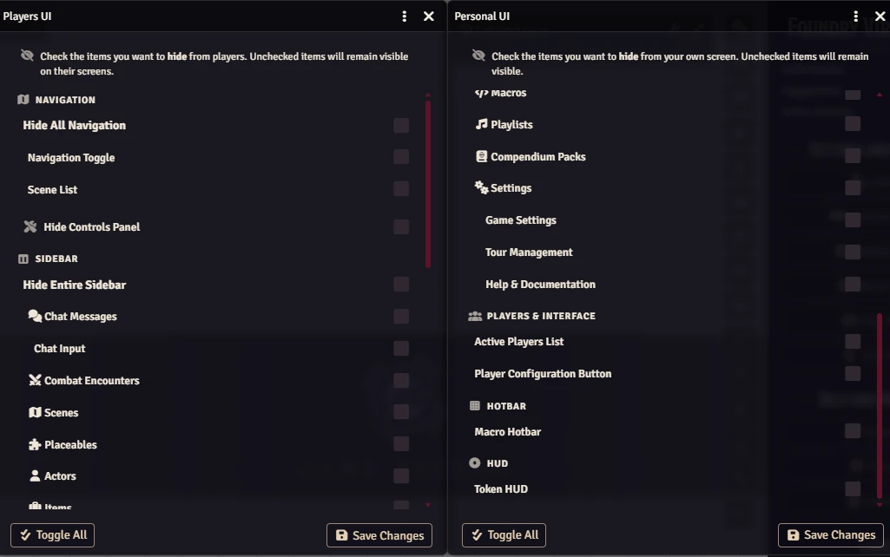

# Hide UI

> **Take back your screen.** Hide UI gives Game Masters full control over what players see in the Foundry VTT interface.

[](https://buymeacoffee.com/mestredigital)

---

## What is Hide UI?

Foundry VTT is packed with buttons, panels, and tabs — which is great for Game Masters, but can be overwhelming or distracting for players. **Hide UI** lets you choose exactly which parts of the interface are visible for each player, creating a cleaner, more immersive experience at the table.

Only the GM decides what players see. Players cannot change their own UI visibility.



---

## ✨ Features

- **Global player defaults** — configure which UI elements all connecting players see by default.
- **Per-player control** — apply (or skip) those defaults for each individual player.
- **GM Personal UI** — the GM can also configure their own screen independently from the player settings.
- **Real-time broadcast** — your changes reach every connected client the moment you save.
- **New-player safe** — any player who joins for the first time automatically gets the GM's settings applied.
- **Master toggles** — hide an entire section (e.g. the whole sidebar) with a single switch.

---

## 🖥️ What Can Be Hidden?

| UI Area | Elements You Can Toggle |
|---|---|
| **Navigation** | Full navigation bar · Nav toggle button · Scene list · Boss Bar |
| **Controls** | Left-side controls panel (the toolbelt) |
| **Sidebar** | Entire sidebar · Chat messages · Chat input box · Combat encounters · Scenes · Placeables · Actors · Items · Journal · Rollable tables · Card stacks · Macros · Playlists · Compendium packs · Settings tab · Dice So Nice tab |
| **Settings tab contents** | Game Settings · Active Modules · Tour Management · Help & Documentation |
| **Players & Interface** | Active players list · Player configuration button |
| **Hotbar** | Standard macro hotbar |
| **HUD** | Token HUD · Token Action HUD |

> **Tip:** You don't have to hide everything — even removing just the combat tracker or the compendium tab can make a huge difference for players who find the interface busy.

---

## 🛠️ How to Use

1. Open **Game Settings** → **Module Settings** → **Hide UI**.
2. You will find three configuration menus:

   | Menu | Purpose |
   |---|---|
   | **Personal UI** | Configure which UI elements are hidden on the GM's own screen |
   | **Players UI** | Set the default visibility for every connecting player |
   | **Player Visibility** | Choose which players the defaults apply to |

3. Open **Players UI**, toggle the elements you want to hide, and click **Save**.
4. Open **Player Visibility** to see a list of all your players. Toggle each one on or off to control who receives the hidden-UI settings.
5. Optionally open **Personal UI** to configure the GM's own screen separately from the player settings. A page reload is required to apply personal UI changes.





---

## 🔌 Optional Module Support

Hide UI automatically detects the following modules and adds their UI elements to the toggle list when they are active:

| Module | Extra Toggle Added |
|---|---|
| [Token Action HUD](https://foundryvtt.com/packages/token-action-hud-core) | Token Action HUD panel |
| [Dice So Nice!](https://foundryvtt.com/packages/dice-so-nice) | Dice So Nice sidebar tab |
| [Boss Bar](https://foundryvtt.com/packages/bossbar) | Boss Bar |

No extra configuration is needed — if the module is installed and active, the option appears automatically.

---

## 📦 Installation

1. Open Foundry VTT and go to **Add-on Modules**.
2. Click **Install Module**.
3. Paste the following manifest URL in the **Manifest URL** field at the bottom:

```
https://raw.githubusercontent.com/brunocalado/hide-ui/main/module.json
```

4. Click **Install** and then enable the module in your world.

---

## 🆘 Emergency Reset

If you accidentally hide the Settings tab for all players — or find yourself in a state where you can no longer access the module settings from the UI — you can reset everything from the browser console.

1. Press **F12** to open the browser developer tools.
2. Go to the **Console** tab.
3. Type the following command and press **Enter**:

```js
HideUI.Reset()
```

This will:
- Set **Players UI** to hide all elements for all players (a safe known state you can then reconfigure).
- Re-enable the **Player Visibility** toggle for every player, so all players are affected on their next login.
- Clear the **Personal UI** configuration from every user's flags and local storage.
- Force every connected client to reload immediately.

> **Note:** This command can only be run by the GM. After the reset, open **Players UI** and reconfigure the visibility settings from scratch.

---

## 🐛 Bug Reports & Feature Requests

Found a bug or have an idea for a new feature? Open an issue on GitHub:

👉 https://github.com/brunocalado/hide-ui/issues

---

## Credits and License

This module is released under the [GNU General Public License v3](LICENSE).

The new hide-ui module has undergone a profound redesign compared to the original hide-player-ui code, totaling 931 modified lines of code (470 insertions and 461 deletions) across 32 impacted files. The project was completely restructured for Foundry VTT v14: the original module's interface scripts, CSS styles, and old .html templates were entirely discarded. In their place, a robust architecture based on Handlebars templates (.hbs) was built, introducing new logic files such as user-configuration-form.js, hide-ui.js, helpers.js, and constants.js. The result is a brand-new, clean, and significantly expanded module developed from the original codebase.

This module is a fork of [hide-player-ui](https://github.com/gsimon2/hide-player-ui) by gsimon2. Thank you for the original work that made this possible.
